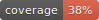

# EukCC 



EukCC is a completeness and contamination estimator for metagenomic assembled
microbial eukaryotic genomes. 

With version 2, EukCC should provide a better experience than
version 1. We aim at creating a stable package with long term support.

**Note**: Version 2 is not compatible with previous versions, most commandline arguments changed.
So version 2 is **not** a drop in replacement.

## Documentation
Head over to https://eukcc.readthedocs.io/ to check out the documentation.


## Quickstart

Here a super fast overview on how to get started using singularity. For more information
please see the documentation.

```
# create a folder were to keep the database
mkdir eukccdb
cd eukccdb
wget http://ftp.ebi.ac.uk/pub/databases/metagenomics/eukcc/eukcc2_db_ver_1.2.tar.gz
tar -xzvf eukcc2_db_ver_1.2.tar.gz
export EUKCC2_DB=$(realpath eukcc2_db_ver_1.2)

# fetch and launch container
singularity pull docker://quay.io/microbiome-informatics/eukcc

singularity exec eukcc_latest.sif eukcc single -h
```

Alternatively you can install EukCC using pip, but we recommend using the container.

## Get the container

Get EukCC quickly by fetching the container. 

The container is hosted and automatically build from the master branch here: 
https://quay.io/repository/microbiome-informatics/eukcc
```
docker pull quay.io/microbiome-informatics/eukcc
singularity pull docker://quay.io/microbiome-informatics/eukcc
```
If you installed version 2: make sure to also fetch the database for version 2:

http://ftp.ebi.ac.uk/pub/databases/metagenomics/eukcc/


## Outputs explanation

- `eukcc.log` - log of execution

### eukcc single

- `eukcc.csv` - table with estimated completeness, contamination and taxonomy lineage

### eukcc folder

- `eukcc.csv` - table with estimated completeness, contamination and taxonomy lineage for **good** quality bins
- `merged_bins.csv` - table of merged refined bins
- `bad_quality.csv`- table with estimated completeness, contamination and taxonomy lineage for **bad** quality bins (chosen marker gene set is supported by less than half of the alignments)
- `missing_marker_genes.txt` - line separated list of bins with not defined set of marker genes
- `merged_bins` - folder with merged bins sequences 
- `refine_workdir` - working directory with intermediate steps results


## Don't use EukCC on already pubished data
Or at least not without thinking about it:

You should not use EukCC on already published genomes, if they have used during training of the marker 
gene sets. If you want to make sure, you can see all used accessions in the database file `db_base/backbone/base_taxinfo.csv`.

## Cite

If you use EukCC make sure to cite:

```
Saary, Paul, Alex L. Mitchell, and Robert D. Finn. 
"Estimating the quality of eukaryotic genomes recovered from metagenomic analysis with EukCC." 
Genome biology 21.1 (2020): 1-21.
```

EukCC also uses metaEUK, hmmer, pplacer, ete3 and epa-ng. 


## Changed compared to EukCC 1
- Users can set the prevalence threshold  for marker sets. In EukCC 1 
  this was fixed to 98% single copy prevalence.  Now users could change that to be more strict.
  We find that often 100% single copy prevalence can be found. 

## Issues and bugs

Please report any bugs and issues here on GitHub. Make sure to
include the debug log (run eukcc using `--debug` flag).

### used exit codes
- 200: File not found
- 201: No Marker gene set could be defined
- 202: No database provided
- 203: Corrupted file
- 204: Predicted zero proteins 
- 222: Invalid settings


